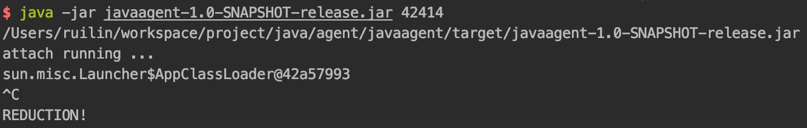

# Hotplug Agent - 热插拔 Java Agent Demo

## Java Agent 热部署 热卸载

* 启动springboot项目 可增加 `-verbose:class` 参数

* 打包javaagent
  ```
  cd javaagent
  mvn package assembly:single
  ```

* 查看DemoSpringApplication pid
  ```
  jps
  ```

* 部署javaagent
  ```
  cd target
  java -jar javaagent-1.0-SNAPSHOT-release.jar <pid>
  ```
  
  
  通过jvisualvm查看堆状态
  
  热部署成功
  
* 访问 http://localhost:8888/index/hello
  
  织入成功
  
* 卸载javaagent
  `^C`终止运行
  
  
  通过jvisualvm查看堆状态
  
  热卸载成功 织入代码删除 恢复项目原运行状态
  
  ---
### 参考
https://github.com/alibaba/jvm-sandbox

https://github.com/pippolover/faultinject

https://github.com/CHDQ/Instrumentation-usage
